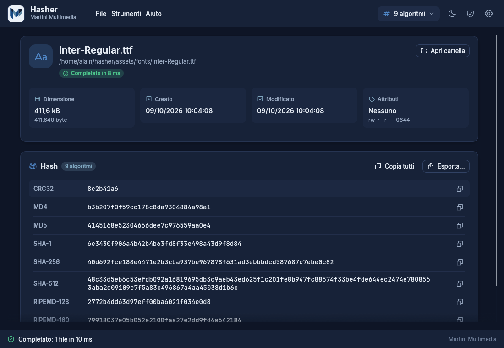
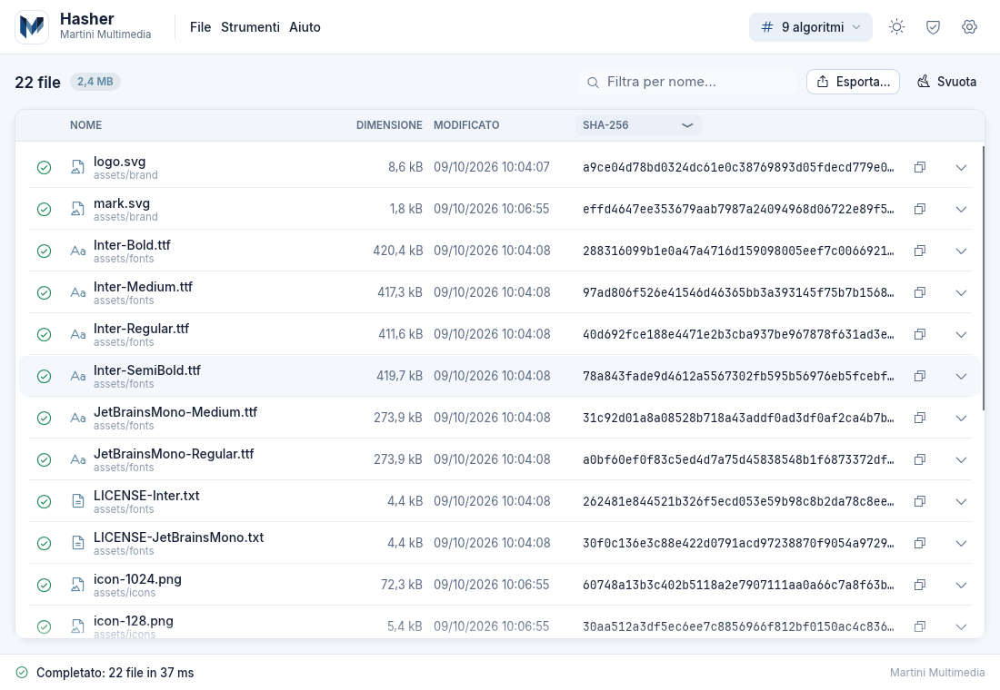
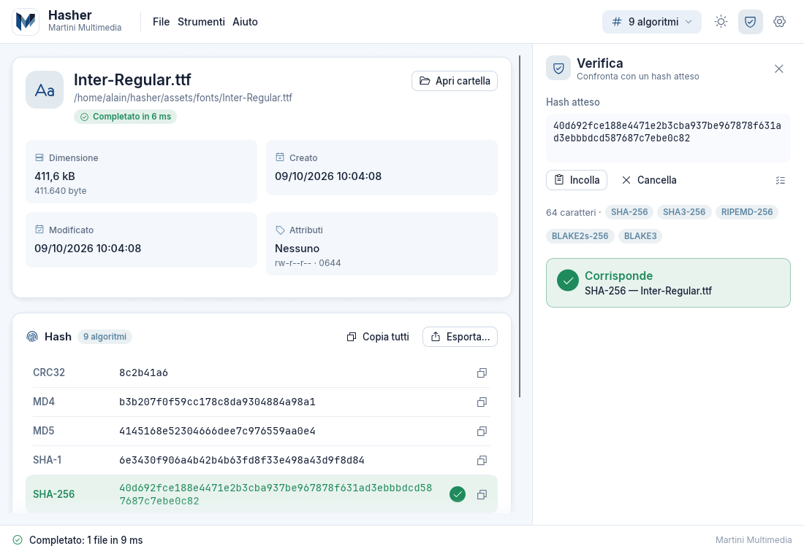
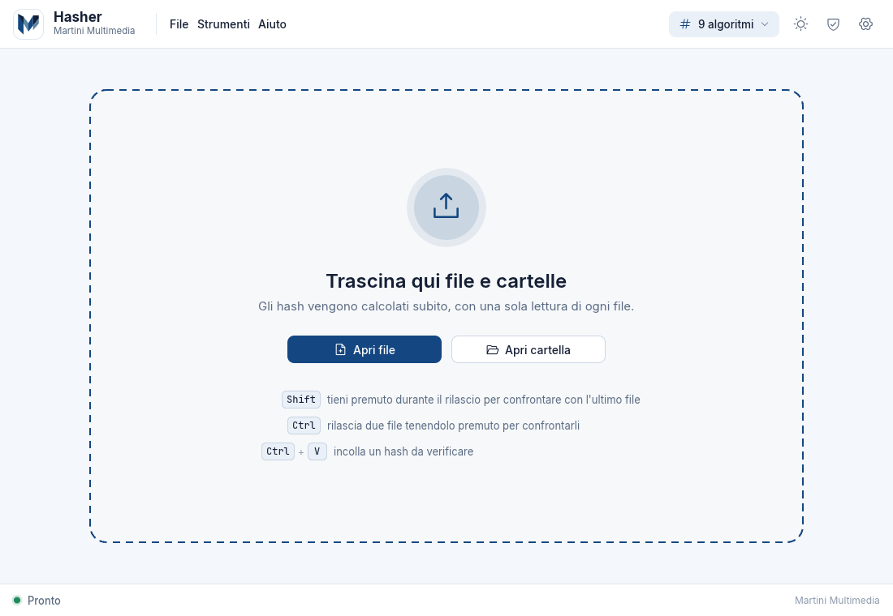

<p align="center">
  
</p>

<h1 align="center">Hasher</h1>

<p align="center">
  Calcola e verifica gli hash di uno o più file: portable, veloce, per Linux, Windows e macOS.
</p>

<p align="center">
  <b>English:</b> Hasher is a portable, multi-platform hash calculator and verifier written in pure Rust.
  Documentation in English is in the <a href="https://github.com/inalto/hasher/wiki">project wiki</a>;
  binaries for Windows, Linux and macOS are on the <a href="https://github.com/inalto/hasher/releases">Releases</a> page.
</p>

<p align="center">
  <a href="https://github.com/inalto/hasher/actions/workflows/ci.yml"></a>
  <a href="https://github.com/inalto/hasher/releases/latest"></a>
</p>

---

Hasher è scritto in Rust puro con [egui/eframe](https://github.com/emilk/egui) (rendering OpenGL):
un solo eseguibile, nessun runtime da installare, nessun installer. Trascini uno o più file
sulla finestra e ottieni subito tutti gli hash, calcolati in parallelo con **un'unica lettura**
del file.

## Screenshot

<p align="center">
  
  
</p>
<p align="center">
  
  
</p>

## Funzionalità

### Algoritmi di hash

| Gruppo | Algoritmi |
|---|---|
| Checksum | CRC32, CRC64 (XZ/ECMA), xxHash64, xxHash3-128 |
| MD | MD2, MD4, MD5 |
| SHA | SHA-1, SHA-224, SHA-256, SHA-384, SHA-512, SHA3-256, SHA3-512 |
| RIPEMD | RIPEMD-128, RIPEMD-160, RIPEMD-256, RIPEMD-320 |
| BLAKE | BLAKE2b-512, BLAKE2s-256, BLAKE3 |
| P2P | ED2K (convenzione eMule: blocchi da 9.728.000 byte) |

Di default sono attivi CRC32, MD4, MD5, SHA-1, SHA-256, SHA-512, RIPEMD-128, RIPEMD-160 ed
ED2K; gli altri si attivano dalle impostazioni. MD2 è disponibile ma non è attivo di default:
è un algoritmo seriale che viaggia a circa 7–10 MB/s e rallenterebbe l'intero calcolo (nell'interfaccia
è contrassegnato come *lento*).

### Uso

- **File singolo**: scheda con nome, percorso completo, dimensione (leggibile ed esatta in byte),
  date di creazione e modifica, attributi (sola lettura, nascosto, sistema, archivio, link
  simbolico; permessi POSIX su Linux e macOS) e una riga per ogni hash con pulsante *copia*.
- **Più file e cartelle**: tabella con nome, dimensione, data, stato (in coda / in corso / completato
  / errore) e l'hash dell'algoritmo scelto; ogni riga si espande per mostrare tutti gli hash. Barra
  di stato con avanzamento complessivo, velocità (MB/s) e tempo stimato, pulsante *Annulla*. Le
  cartelle trascinate vengono esplorate (ricorsione configurabile).
- **Drag & drop**: trascina file o cartelle sulla finestra; la zona di rilascio pulsa quando un file
  è sopra l'applicazione. Rilasciando con **Shift** o **Ctrl** premuto i file vengono confrontati
  tra loro (maggiori dettagli nella guida integrata, `F1`).

### Verifica

- **Hash incollato**: incolla un hash atteso (`Ctrl+V`); Hasher ignora spazi, due punti e maiuscole,
  riconosce l'algoritmo dalla lunghezza e mostra *Corrisponde (SHA-256)* oppure *Nessuna
  corrispondenza*. In lista evidenzia il file che corrisponde.
- **File di checksum**: trascinando un file `.md5`, `.sha1`, `.sha256`, `.sha512` o `.sfv` (formato
  GNU coreutils `hash  nome` oppure BSD `ALGO (nome) = hash`) vengono verificati tutti i file
  elencati, con esito OK / FALLITO / MANCANTE per ciascuno.
- **Confronto tra due file**: selezionando due righe (o con Shift/Ctrl al rilascio) Hasher indica,
  algoritmo per algoritmo, se i due file sono identici.

### Esportazione

TXT (rapporto leggibile), CSV, JSON, XLSX (Excel), DOCX (Word) e **file di checksum** (`.sha256`,
`.md5`, … in formato GNU, riutilizzabile per la verifica con `sha256sum -c` o con Hasher stesso).
Il salvataggio usa il dialogo nativo del sistema.

### Interfaccia e impostazioni

- **5 lingue**: italiano, inglese, francese, tedesco e spagnolo; di default segue la lingua del
  sistema, con cambio immediato dalle impostazioni.
- **Tema chiaro/scuro automatico**: segue il sistema operativo, con scelta manuale.
- **Impostazioni portable**: il file `hasher.settings.json` viene salvato *accanto
  all'eseguibile* se la cartella è scrivibile (ideale per una chiavetta USB), altrimenti nella
  cartella di configurazione dell'utente.
  Su macOS, quando l'app è dentro un bundle `Hasher.app`, la cartella "portable" è quella che
  contiene il bundle.
- **Scorciatoie**: `Ctrl+O` apri file · `Ctrl+Shift+O` apri cartella · `Ctrl+E` esporta ·
  `Ctrl+V` incolla hash da verificare · `Ctrl+,` impostazioni · `F1` guida · `Esc` annulla/chiudi ·
  `Canc` rimuovi le righe selezionate · `Ctrl+L` svuota l'elenco.

## Download / Portable

Gli eseguibili si scaricano dalla pagina [Releases](https://github.com/inalto/hasher/releases)
del repository. Ogni release contiene anche `SHA256SUMS.txt` per controllare l'integrità dei file
scaricati (con `sha256sum -c SHA256SUMS.txt` oppure, naturalmente, con Hasher).

| Piattaforma | Archivio | Contenuto |
|---|---|---|
| Linux x86_64 | `hasher-<versione>-linux-x86_64.tar.gz` | cartella con `hasher`, `README.md`, `hasher.desktop`, `icon.png`, `LICENSES-fonts/` |
| Windows x86_64 | `hasher-<versione>-windows-x86_64.zip` | `hasher.exe`, `README.md`, `LICENSES-fonts\` |
| macOS (Intel + Apple Silicon) | `hasher-<versione>-macos-universal.zip` | `Hasher.app` (binario universale) |

### Windows

Decomprimi lo zip ed esegui `hasher.exe`: non richiede installazione né privilegi di
amministratore. L'eseguibile non è firmato digitalmente, quindi al primo avvio SmartScreen può
mostrare "Windows ha protetto il PC": scegli *Ulteriori informazioni* → *Esegui comunque*.

### macOS

Decomprimi lo zip e sposta `Hasher.app` dove preferisci (per esempio in *Applicazioni*). L'app è
**non firmata e non notarizzata**: alla prima apertura Gatekeeper la blocca. Per autorizzarla
rimuovi l'attributo di quarantena dal Terminale:

```sh
xattr -dr com.apple.quarantine Hasher.app
```

In alternativa, apri l'app con clic destro → *Apri* (o da *Impostazioni di Sistema → Privacy e
sicurezza → Apri comunque*). Richiede macOS 10.15 o successivo.

### Linux

```sh
tar xzf hasher-<versione>-linux-x86_64.tar.gz
cd hasher-<versione>-linux-x86_64
./hasher
```

Servono le librerie di runtime GTK3 (dialoghi di apertura e salvataggio), X11 o Wayland e
OpenGL/Mesa: sono presenti su qualsiasi desktop. Su un sistema minimale installa, per esempio,
`libgtk-3-0`, `libgl1` e `libxkbcommon0` (Debian/Ubuntu) oppure `gtk3`, `mesa-libGL` e
`libxkbcommon` (Fedora/RHEL). L'eseguibile è compilato in un container Rocky Linux 8 (glibc 2.28), quindi
funziona su RHEL/Alma/Rocky 8 e successivi, Ubuntu 20.04+, Debian 10+ e distribuzioni più recenti.

Integrazione opzionale nel menu delle applicazioni:

```sh
install -Dm755 hasher       ~/.local/bin/hasher
install -Dm644 icon.png     ~/.local/share/icons/hicolor/256x256/apps/hasher.png
install -Dm644 hasher.desktop ~/.local/share/applications/hasher.desktop
```

## Compilare dal sorgente

Requisiti comuni: [Rust](https://rustup.rs) stable **≥ 1.95** (`rust-version` in `Cargo.toml`).

### Linux

```sh
scripts/dev-deps-debian.sh      # Debian / Ubuntu
scripts/dev-deps-el9.sh         # AlmaLinux / RHEL / Rocky 9
cargo build --release
```

Gli script installano GTK3, xkbcommon, Wayland, OpenGL (Mesa) e Xvfb (per gli screenshot headless).
Il binario si trova in `target/release/hasher`.

### Windows

Installa [Visual Studio Build Tools](https://visualstudio.microsoft.com/downloads/) con il carico
di lavoro *Sviluppo di applicazioni desktop con C++* (toolchain MSVC e Windows SDK, che fornisce
`rc.exe`), poi:

```powershell
cargo build --release
```

Il binario si trova in `target\release\hasher.exe`; `build.rs` vi incorpora icona e metadati
(se `rc.exe` non è disponibile la compilazione prosegue con un avviso, ma senza icona).

### macOS

Servono gli strumenti da riga di comando di Xcode (`xcode-select --install`), poi:

```sh
cargo build --release
```

Il binario si trova in `target/release/hasher`. Per ottenere l'app universale `Hasher.app`:

```sh
rustup target add x86_64-apple-darwin aarch64-apple-darwin
cargo build --release --target x86_64-apple-darwin
cargo build --release --target aarch64-apple-darwin
mkdir -p target/universal
lipo -create -output target/universal/hasher \
  target/x86_64-apple-darwin/release/hasher target/aarch64-apple-darwin/release/hasher
scripts/bundle-macos.sh 0.1.0 target/universal/hasher     # crea dist/Hasher.app e lo zip
```

### Pacchetti portable

Dopo `cargo build --release` (i file finiscono in `dist/`):

```sh
scripts/package-linux.sh 0.1.0                  # dist/hasher-0.1.0-linux-x86_64.tar.gz
```

```powershell
pwsh scripts/package-windows.ps1 0.1.0          # dist\hasher-0.1.0-windows-x86_64.zip
```

Su GitHub il workflow `release.yml` fa tutto questo da solo: basta pubblicare un tag
`vX.Y.Z` (per esempio `git tag v0.1.0 && git push origin v0.1.0`) e gli archivi per le tre
piattaforme compaiono nella release, insieme a `SHA256SUMS.txt`.

## Sviluppo

```sh
cargo test                                    # test unitari e di integrazione
cargo fmt --all --check                       # formattazione (rustfmt.toml)
cargo clippy --all-targets -- -D warnings     # lint
```

La CI (`.github/workflows/ci.yml`) esegue le stesse verifiche su Linux a ogni push e pull request
verso `main`, e compila in release su Linux, Windows e macOS.

### Riga di comando

```text
hasher [--screenshot <file.png>] [--screenshot-frames <n>] [file...]
```

I percorsi passati come argomenti vengono aperti subito. `--screenshot <file.png>` salva uno
screenshot della finestra ed esce; `--screenshot-frames <n>` imposta dopo quanti fotogrammi
(predefinito: 30) scattarlo. Servono ai test grafici automatici.

### Screenshot headless (Linux)

```sh
cargo build
scripts/screenshot.sh /tmp/hasher.png                       # finestra vuota
HASHER_THEME=dark scripts/screenshot.sh /tmp/lista.png a.iso b.iso
```

Lo script avvia Xvfb sul display `:99` (se non è già attivo), usa il rendering software di Mesa
(`LIBGL_ALWAYS_SOFTWARE=1`), punta le impostazioni a un file temporaneo (`HASHER_SETTINGS_PATH`)
per non toccare quelle reali e termina in al più 90 secondi. `HASHER_THEME=light|dark|system` forza il
tema. Le dipendenze si installano con `scripts/dev-deps-*.sh`.

### Struttura del progetto

```
hasher/
├── Cargo.toml          dipendenze, profilo release (LTO, strip)
├── build.rs            icona e metadati dell'.exe su Windows (winresource)
├── assets/
│   ├── brand/          logo.svg, mark.svg
│   ├── icons/          icon.svg, icon-*.png (16–1024), icon.ico
│   ├── fonts/          Inter, JetBrains Mono e relative licenze
│   └── linux/          hasher.desktop
├── locales/            it.yml en.yml fr.yml de.yml es.yml (rust-i18n, compilati nel binario)
├── src/
│   ├── main.rs         avvio, argomenti da riga di comando
│   ├── lib.rs          crate libreria (costanti, i18n)
│   ├── backend/        algo, hasher, engine, checksum_file, fileinfo, settings, export/
│   └── ui/             interfaccia egui: tema, viste, verifica, impostazioni, guida
├── tests/              test d'integrazione
├── scripts/            pacchetti (Linux/Windows/macOS), icns, screenshot, dipendenze di sviluppo
├── docs/PIANO.md       piano di sviluppo e criteri di accettazione
└── .github/workflows/  ci.yml (verifiche e build), release.yml (artefatti e release)
```

## Crediti e licenze

- Font **Inter** e **JetBrains Mono**: [SIL Open Font License 1.1](https://openfontlicense.org);
  i testi delle licenze sono in `assets/fonts/` e nella cartella `LICENSES-fonts/` dei pacchetti.
- Icone **Phosphor** (crate `egui-phosphor`): MIT.
- **egui** / **eframe** (Emil Ernerfeldt e contributori): MIT o Apache-2.0.
- Algoritmi di hash: famiglia **RustCrypto** (MD2, MD4, MD5, SHA-1/2/3, RIPEMD, BLAKE2:
  MIT o Apache-2.0), **BLAKE3** (CC0-1.0 o Apache-2.0), `crc32fast` e `crc` (MIT o Apache-2.0),
  `xxhash-rust` (BSL-1.0).
- Altre dipendenze notevoli: `rfd` (dialoghi nativi, MIT), `rust_xlsxwriter` (XLSX), `docx-rs`
  (DOCX), `rust-i18n`, `rayon`, `serde`. L'elenco completo è in `Cargo.toml` e `Cargo.lock`.

© Martini Multimedia s.a.s.
