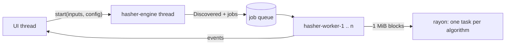

# Architecture

Hasher is one Cargo crate with a **library** (`src/lib.rs`: `backend` and `ui` modules, plus the constants `APP_NAME`, `APP_VERSION`, `COMPANY`) and a **thin binary** (`src/main.rs`: initialises `env_logger`, parses the command line and calls `ui::run`). The backend has no dependency on the UI, so it is fully testable on its own. Folder-by-folder layout: [[Building from Source]].

> The original Italian plan is `docs/PIANO.md`. Where the code and the plan differ, this page follows the code (for example the engine event is `Discovered`, not `Queued`, and digests are stored as raw bytes).

## Why egui and not Tauri

The first idea was Rust + Tauri. Tauri 2 needs `webkit2gtk-4.1` and `libsoup3`, which the development machine (AlmaLinux 9) does not provide (it only has webkit2gtk-4.0 / libsoup 2), so it could not be built natively. Pure Rust with **egui/eframe** also suits a *portable* tool better: one executable with no WebView to require on the target system, no Node/npm toolchain, simple cross-compilation, native OS drag and drop, and an OpenGL (`glow`) renderer that even runs on Mesa software rendering under Xvfb for automated screenshots. Slint lacked reliable file-drop support at the time and iced's API was less stable.

## Backend (`src/backend/`)

| Module | Contract |
|---|---|
| `algo.rs` | `enum Algo` (22 variants, serde ids such as `sha3-256`), `ALL`, `DEFAULT` (9, without MD2), `name()`, `id()`, `digest_len()`, `hex_len()`, `group()`, `is_slow()` (MD2), `candidates_for_hex_len()`, `from_checksum_extension()`, `from_label()`, `checksum_extension()`, plus `normalize_hex()` and `to_hex()` |
| `hasher.rs` | Own `trait StreamHasher { update(&mut self, &[u8]); finalize(self: Box<Self>) → Vec<u8> }`, `build(Algo)`, `hash_bytes()`, `ED2K_CHUNK` |
| `engine.rs` | Sessions: `start(inputs, EngineConfig) → (EngineHandle, Receiver<EngineEvent>)`, `hash_file()`, `collect_files()`, `FileResult` |
| `checksum_file.rs` | `parse_text()`, `load()`, `is_checksum_file()`, `CHECKSUM_EXTENSIONS`, `ChecksumEntry` |
| `fileinfo.rs` | `FileInfo`, `FileAttr` (16 attributes with short codes), `read()` |
| `settings.rs` | `Settings` (serde), `Language`, `ThemeMode`, `WindowState`, `load()/save()/path()/is_portable()` |
| `export/` | `ExportFormat`, `ExportLabels`, `ExportOptions`, `export()` dispatching to `txt_fmt`, `csv_fmt`, `json_fmt`, `xlsx_fmt`, `docx_fmt`, `checksum_fmt` |

**`StreamHasher` instead of the `Digest` trait.** RustCrypto types are wrapped by one generic adapter; CRC32 (`crc32fast`), CRC64 (`crc`, `CRC_64_XZ`, slice-by-16 table), xxHash64/XXH3-128 (`xxhash-rust`), BLAKE3 and ED2K have their own small wrappers. This keeps every algorithm uniform and independent of the version of the external `digest` crate. The numeric checksums return big-endian bytes. ED2K streams its chunks into an inner MD4 and never buffers a chunk.

### The engine

A coordinator thread walks the inputs while `parallel_files` worker threads pull files from a queue; each worker reads its file in 1 MiB blocks and updates all the hashers in parallel with rayon. Events flow back to the UI over a channel.

- **Events** (`EngineEvent`): `Discovered {id, path, size}`, `Started {id}`, `Progress {id, bytes_done}` (at most every 50 ms per file), `Finished(Box<FileResult>)`, `Failed {id, path, error}` and `AllDone {files_ok, files_failed, cancelled, elapsed}`. `FileResult` holds `id`, `info: FileInfo`, `digests: BTreeMap<Algo, Vec<u8>>` and `elapsed`.
- **`EngineHandle`** is cloneable and wraps atomics: `cancel()`, `is_cancelled()`, `is_running()`, `bytes_done()`, `bytes_total()`, `files_done()`, `files_total()` and `fraction()`. The UI polls them each frame for the global progress bar.
- **Parallelism**: `parallel_files = 0` means `min(available cores, 4)`; values above 64 are clamped. Discovery and hashing overlap: workers start on the first file while folders are still being walked, so totals grow during the scan.
- **Block loop**: one reusable 1 MiB buffer per worker; hashers are updated with `rayon::par_iter_mut` when there is more than one and the block is at least 64 KiB.
- **Cancellation is cooperative**: an `AtomicBool` is checked before each block and before each file. A file interrupted mid-way produces *neither* `Finished` nor `Failed`; queued files never get `Started`; `AllDone { cancelled: true }` closes the session. If the receiver is dropped the session cancels itself.
- **Robustness**: a panic while hashing a file is caught and reported as a `Failed`; metadata read errors fall back to essential `std::fs` data so a computed result is never lost; `bytes_total` is reconciled with the bytes actually read, so a finished session ends with `bytes_done == bytes_total`.
- **Walking** (`walkdir`): sorted by name, `min_depth(1)`, depth 1 when not recursive, dot-names (and the Windows Hidden attribute) pruned unless `include_hidden`, symlinks followed only when asked; duplicates removed; unreadable explicit inputs become `Discovered` + `Failed`.

## UI (`src/ui/`)

`HasherApp` (in `mod.rs`) implements `eframe::App`. It owns the entry list, the settings, the engine session and the verification state. Views only *read* state and push `Action` values (`OpenFiles`, `ShowExport`, `Cancel`, `ToggleAlgo`, ...) onto a queue that is executed at the end of the frame, which keeps drawing code free of side effects such as native dialogs.

Each frame: `poll_engine` drains events with `try_recv` (and asks for a repaint every 33 ms while a session runs), `handle_input` processes shortcuts, paste and dropped files, the views are drawn, then actions run.

| Module | Role |
|---|---|
| `theme.rs` | Palettes, `Visuals` for light/dark, fonts, spacing |
| `anim.rs` | Pulse, shimmer, fades, animated counters, arc spinner; all switched off by *Animations = off* |
| `widgets.rs` | Hash row, badges, buttons, cards, progress bar, toasts |
| `topbar.rs`, `statusbar.rs` | Menus, algorithm selector, theme/verify/settings buttons; progress, speed, ETA |
| `dropzone.rs` | Empty state and the full-window drag overlay |
| `single.rs`, `list.rs` | Single-file card; virtualised hand-drawn table with expandable rows |
| `verify.rs` | Verify / compare / checksum panel |
| `settings.rs`, `help.rs`, `export.rs` | Windows (draft-based settings, guide/shortcuts/about, export dialog) |
| `format.rs` | Localised sizes, speeds, durations, dates |

### Visual identity

Colours come from the logo (`#151F35` navy, `#144781` primary blue, `#5B85A1` steel blue). No colour is defined outside `theme.rs`.

| Token | Light | Dark |
|---|---|---|
| background / surface / elevated | `#F4F7FB` / `#FFFFFF` / `#EAF0F7` | `#0E1526` / `#172238` / `#1F2C47` |
| text / muted text | `#151F35` / `#5B6B82` | `#E6ECF4` / `#9AAAC2` |
| primary / accent | `#144781` / `#5B85A1` | `#4F86C6` / `#7FA6C0` |
| success / error / warning | `#1F8A5B` / `#C8433F` / `#B9780A` | `#4CC38A` / `#E5635F` / `#F2B035` |

Fonts (embedded in the binary): **Inter** Regular/Medium/SemiBold/Bold for the interface, **JetBrains Mono** Regular/Medium for hashes, **Phosphor** icons (`egui-phosphor`). The theme preference maps to egui's `ThemePreference`, so *Automatic* follows the OS.

## Internationalisation

`rust_i18n::i18n!("locales", fallback = "en")` compiles `locales/*.yml` into the binary. Keys are nested (`menu.open_files`, `verify.status_ok`) and used as `t!("section.key")`; plurals use a `_one` suffix chosen by `format::plural_key`. `Language::resolve()` maps `Auto` to the system locale through `sys-locale` (`it_IT.UTF-8` → `it`), with English for anything unsupported. Export labels are translated by the UI and passed down, so the export code does not depend on `rust-i18n`. All five locale files (`it`, `en`, `fr`, `de`, `es`) carry the complete key set; a CI-independent Python check compares key sets and placeholders across them.

## Settings persistence

`Settings` is serialised with serde (`#[serde(default)]`, tolerant of unknown keys and unknown algorithm ids). The path is resolved once per process: `HASHER_SETTINGS_PATH` → next to the executable (macOS: next to the `.app` bundle) if the file exists or a probe file can be created → `<config_dir>/MartiniMultimedia/Hasher/` → the working directory. Saves are atomic (`.tmp` + rename). The UI edits a *draft* copy and commits on **Save**; the window geometry is stored on exit. See [[Settings]].

## Export pipeline

The UI collects the finished `FileResult`s (all or selected), builds `ExportOptions` (algorithms, uppercase flag, translated `ExportLabels`, app name/version/company, timestamp, `chrono` date format) and calls `export::export(path, format, results, opts)`. Shared helpers (`FileRow`, `file_rows`, `meta_rows`) give the tabular formats the same formatted values. Details of each format: [[Exporting]].

## Testing strategy

- **Known-answer vectors** (`tests/hash_vectors.rs`) for every algorithm: `""`, `"abc"`, `"123456789"` and published vectors (RFC 1319/1320, RIPEMD, CRC catalogue "check" values), with each algorithm's declared length asserted.
- **Cross-checks with system tools** on a random multi-MiB file: `md5sum`, `sha*sum`, `b2sum`, Python `hashlib`/`zlib`; skipped when a tool is missing.
- **Streaming equals one-shot**: odd split sizes, and ED2K against an independent non-streaming reference at chunk boundaries (including the exact-multiple case and a small artificial chunk size).
- **Engine integration tests** (`tests/engine.rs`): walking rules (recursion, hidden files, symlinks, duplicates), event ordering, totals, unreadable paths, prompt cancellation (a 48 MiB file with MD2), receiver drop, many small files with several workers.
- **Checksum-file parser tests**: GNU, BSD, SFV, comments, BOM/UTF-16, CRLF, bad lines, round trip from disk.
- **Export tests**: structure and content of every format (CSV BOM and quoting, formula defusing, JSON parse-back, XLSX/DOCX are valid ZIPs with the expected parts), uppercase handling and the **round trip** "exported checksum file parses back identically".
- Unit tests inside modules (settings I/O, locale resolution, attribute mapping, input parsing). CI runs fmt, clippy with `-D warnings` and the test suite on every push and pull request to `main`.
