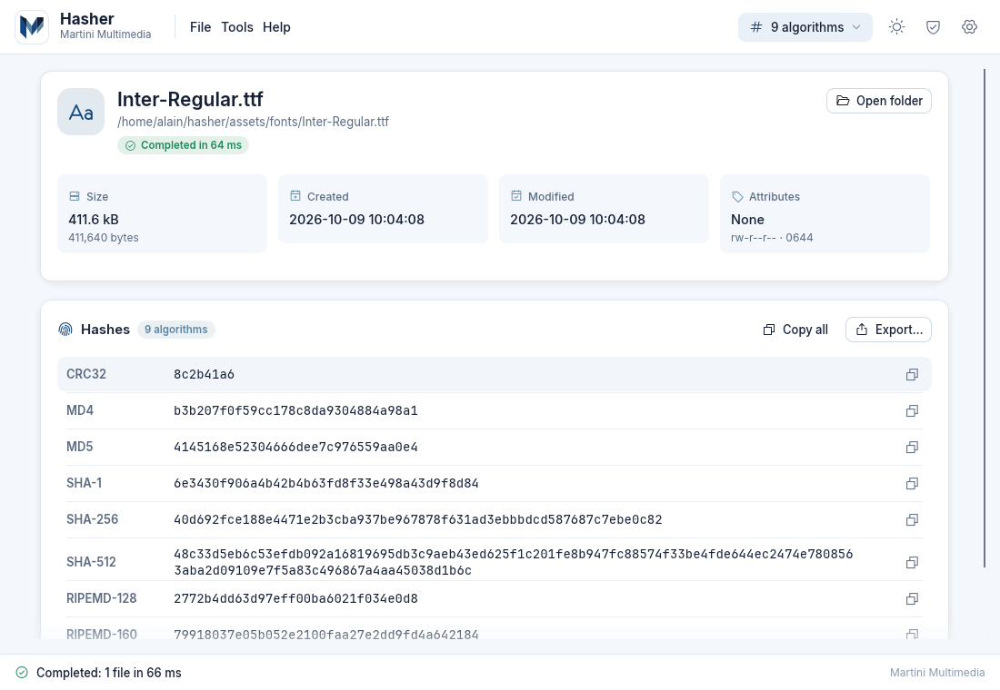
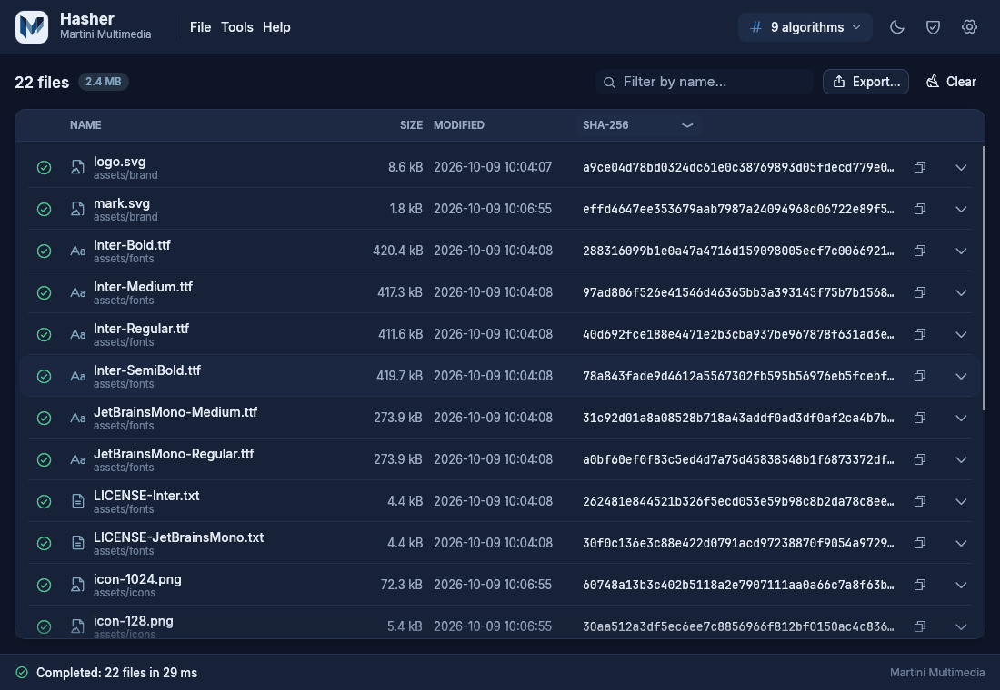

# Hasher

**Hasher** is a portable hash calculator and verifier for **Windows, macOS and Linux**, written in pure Rust by **Martini Multimedia s.a.s.** Drop files or whole folders onto the window and every hash you asked for appears at once: each file is read **only once** and all the algorithms are computed in parallel.

## Key features

- **22 algorithms in one pass**: CRC32, CRC64, xxHash64, xxHash3-128, MD2/MD4/MD5, SHA-1, SHA-224/256/384/512, SHA3-256/512, RIPEMD-128/160/256/320, BLAKE2b-512, BLAKE2s-256, BLAKE3 and ED2K (eMule convention). See [[Algorithms]].
- **Portable**: a single executable, no installer, no runtime to install. Settings are kept next to the program, so it works from a USB stick. See [[Installation]].
- **Drag and drop first**: files, folders (recursive by default), several items at once, or file paths on the command line.
- **Single-file card** with name, path, size (human readable and exact), dates, attributes and permissions, plus one row per hash with a copy button.
- **Multi-file table** with filter, per-column algorithm selector, expandable rows, progress, speed and ETA, cancel and resume.
- **Verification**: paste an expected hash (the algorithm is recognised from its length), drop a checksum file (`.md5`, `.sha256`, `.sfv`, ...) or compare two files. See [[Verifying Hashes]].
- **Export** to TXT, CSV, JSON, XLSX, DOCX or a reusable checksum file. See [[Exporting]].
- **Light and dark themes** (follows the system), subtle animations that can be switched off, toast notifications.
- **Interface languages**: Italian, English, French, German and Spanish, with automatic detection of the system language. See [[Settings]].
- **No web runtime**: a native window drawn with OpenGL (egui), one executable per platform.

## Quick start

1. Download the package for your system from the [Releases page](https://github.com/inalto/hasher/releases) and unpack it (see [[Installation]]).
2. Start `hasher` (`hasher.exe` on Windows, `Hasher.app` on macOS).
3. Drag a file or a folder onto the window. The default algorithms are computed immediately.
4. Click the copy button next to a hash, or press **Ctrl+V** to paste a hash you want to verify.
5. Press **Ctrl+E** to export the results.

## Where to go next

| I want to... | Page |
|---|---|
| Download and run Hasher | [[Installation]] |
| Learn the interface and the shortcuts | [[User Guide]] |
| Check a download against a published hash or a `.sha256` file | [[Verifying Hashes]] |
| Save results as CSV, Excel, Word, JSON... | [[Exporting]] |
| Change defaults (algorithms, theme, language, performance) | [[Settings]] |
| Know what each algorithm is and how fast it is | [[Algorithms]] |
| Compile Hasher myself | [[Building from Source]] |
| Understand the CI, releases and self-hosted runners | [[CI-CD and Self-Hosted Runners]] |
| Read how the code is organised | [[Architecture]] |
| Solve a problem | [[FAQ and Troubleshooting]] |
| Leggere la guida in italiano | [[Guida rapida (Italiano)]] |

## Built with

Rust (stable, 1.95 or newer) and [egui / eframe](https://github.com/emilk/egui) 0.36 with the `glow` (OpenGL) backend. Hashing is done by the RustCrypto crates, `blake3`, `crc32fast`, `crc` and `xxhash-rust`; parallelism by `rayon` and `crossbeam-channel`; native file dialogs by `rfd`; spreadsheets and documents by `rust_xlsxwriter` and `docx-rs`; translations by `rust-i18n`. The interface uses the **Inter** and **JetBrains Mono** fonts and **Phosphor** icons.

## Licence and credits

Hasher is © **Martini Multimedia s.a.s.**, <https://www.martini-multimedia.net>. Third-party components keep their own licences: MIT/Apache-2.0 for most crates, CC0-1.0/Apache-2.0 for BLAKE3, BSL-1.0 for `xxhash-rust`, SIL Open Font License 1.1 for the fonts (the licence texts ship with every download in `LICENSES-fonts/`). The full list is in **Help → About** inside the application.

## Downloads

Binaries for Windows, macOS and Linux are published on the [Releases page](https://github.com/inalto/hasher/releases). Source code and issue tracker: <https://github.com/inalto/hasher>.
