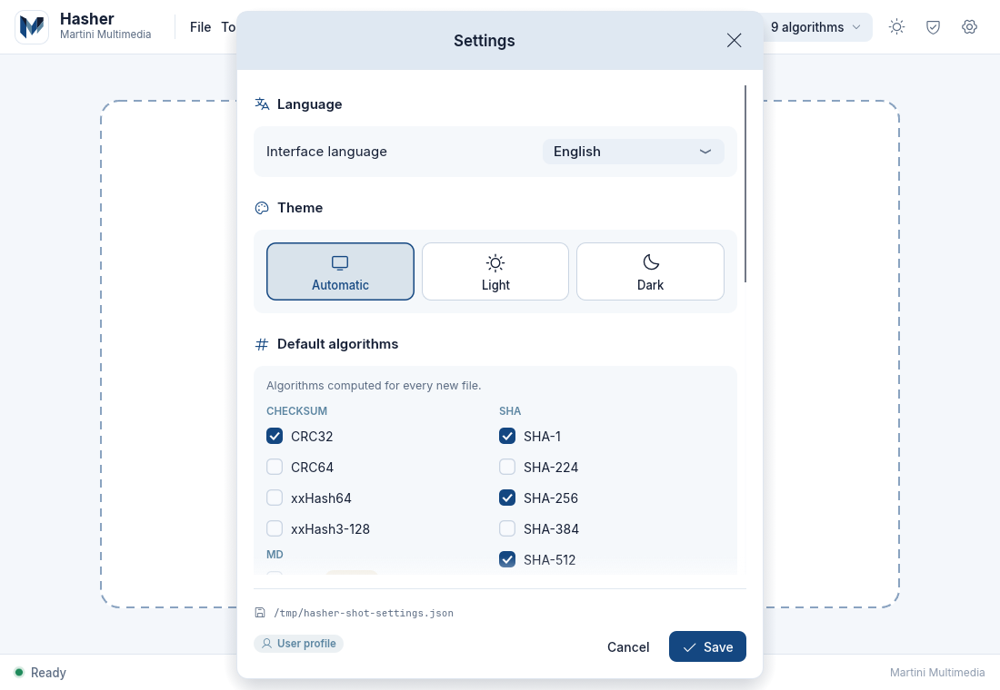

# Settings

Open the settings with the gear icon, **Tools → Settings...** or **Ctrl+,**.



Changes are collected in a draft: the **language** and the **theme** are previewed live, everything else applies when you press **Save** (toast: *Settings saved*). **Cancel**, `Esc` or closing the window discards the draft. The bottom of the window shows the file in use, with a badge: **Portable** (next to the executable) or **User profile**.

## Options

| Option (Settings window) | JSON key | Default | Effect |
|---|---|---|---|
| **Language** → Interface language | `language` | `auto` | `auto` follows the system locale (`it`, `en`, `fr`, `de`, `es`; anything else falls back to English). Changes the whole interface immediately, including export labels and date formats. |
| **Theme** | `theme` | `system` | `system` follows the OS (light if it cannot be detected), `light` or `dark`. The top-bar button cycles the three values and saves immediately. |
| **Default algorithms** | `default_algos` | CRC32, MD4, MD5, SHA-1, SHA-256, SHA-512, RIPEMD-128, RIPEMD-160, ED2K | Algorithms computed for every new file. Buttons: *Select all*, *None* (keeps SHA-256, at least one is required), *Default*. MD2 is off and flagged *slow*. |
| **Uppercase hexadecimal** | `uppercase_hex` | off | Shows and exports hashes with `A-F` instead of `a-f` (SFV files are always uppercase). Applies to the open results at once. |
| **Scan folders recursively** | `recurse_folders` | on | Off: only the files directly inside a dropped folder. |
| **Follow symbolic links** | `follow_symlinks` | off | Off: links found while scanning a folder are skipped. A link you drop yourself is always hashed. |
| **Include hidden files** | `include_hidden` | off | Include files and folders whose name starts with `.` (and, on Windows, with the Hidden attribute) when scanning folders. Files you drop explicitly are never filtered. |
| **Animations** | `animations` | on | Pulsing drop zone, shimmer, fades, animated counters and spinners. Turn off for accessibility or on slow graphics. |
| **Files in parallel** | `parallel_files` | `0` (Auto) | How many files are hashed at the same time. Auto = **min(CPU cores, 4)**. The slider goes from 0 to 8; the file accepts up to 64. |

Not shown in the window but saved in the file: `last_export_format`, `last_export_dir` (remembered by the export dialog) and `window` (position, size and maximised state, restored at the next start).

Notes:

- When you save a different set of default algorithms, the quick selector in the top bar is reset to the new defaults. Conversely, changing the quick selector never alters the saved defaults.
- The default algorithms drive the **speed** of Hasher: every selected algorithm is computed for every block read, so the slowest one sets the pace ([[Algorithms]]).
- With a hard disk, setting *Files in parallel* to `1` avoids head thrashing; with an SSD or NVMe drive 4 or more helps small files.

## The settings file

`hasher.settings.json` is plain, human-editable JSON written with two-space indentation. Writing is atomic (a temporary `hasher.settings.json.tmp` is written, flushed and renamed), so a crash cannot leave a half-written file.

```json
{
  "language": "auto",
  "theme": "dark",
  "default_algos": ["crc32", "md5", "sha1", "sha256", "sha512", "blake3"],
  "uppercase_hex": false,
  "recurse_folders": true,
  "follow_symlinks": false,
  "include_hidden": false,
  "parallel_files": 0,
  "last_export_format": { "checksum": "sha256" },
  "last_export_dir": "/home/anna/Documents",
  "animations": true,
  "window": { "x": 120.0, "y": 80.0, "width": 1100.0, "height": 760.0, "maximized": false }
}
```

- Algorithm ids are lowercase: `crc32 crc64 xxh64 xxh3-128 md2 md4 md5 sha1 sha224 sha256 sha384 sha512 sha3-256 sha3-512 ripemd128 ripemd160 ripemd256 ripemd320 blake2b-512 blake2s-256 blake3 ed2k`.
- `last_export_format` is `null`, one of `"txt" "csv" "json" "xlsx" "docx"`, or `{ "checksum": "<algorithm id>" }`.
- `language` is `"auto"`, `"it"`, `"en"`, `"fr"`, `"de"` or `"es"`; `theme` is `"system"`, `"light"` or `"dark"`.

### Lenient parsing

- A **missing key** takes its default, so `{ "theme": "dark" }` is a valid file.
- **Unknown keys** are ignored.
- **Unknown algorithm names** in `default_algos` (for instance written by a newer version) are dropped one by one with a warning instead of invalidating the file; if none remains, the built-in defaults are used.
- A UTF-8 **BOM** (added by some Windows editors) is accepted.
- A file that is not valid JSON, or has a wrong type or value (for example `"theme": "purple"`), is **ignored completely**: Hasher starts with defaults and will overwrite the file the next time it saves. Keep a copy before hand-editing.

## Where the file lives

See [[Installation]] for the full lookup order. In short: `HASHER_SETTINGS_PATH` if set; else next to the executable when that folder is writable (**portable mode**, ideal for a USB stick); else the per-user configuration folder (`%APPDATA%\MartiniMultimedia\Hasher\`, `~/Library/Application Support/MartiniMultimedia/Hasher/` or `~/.config/MartiniMultimedia/Hasher/`).

To **reset** Hasher, close it and delete `hasher.settings.json` (or just the key you want to reset). The settings are also written when the program quits, so do not edit the file while Hasher is running.

## Environment variables

| Variable | Effect |
|---|---|
| `HASHER_SETTINGS_PATH` | Absolute path of the settings file to use instead of the automatic location. |
| `HASHER_THEME` | `light`, `dark` or `system`: forces the theme for the session, ignoring the saved choice until you use the theme button or save the settings. Mainly for screenshots and tests. |
| `RUST_LOG` | Log level written to the terminal (default `warn`), for example `RUST_LOG=debug`. Windows release builds have no console. |

## Languages

All five languages (Italian, English, French, German, Spanish) are fully translated, including date formats and number separators. Any key missing from a translation file falls back to English. Add or improve a translation by editing `locales/<code>.yml` (see [[Architecture]]).
