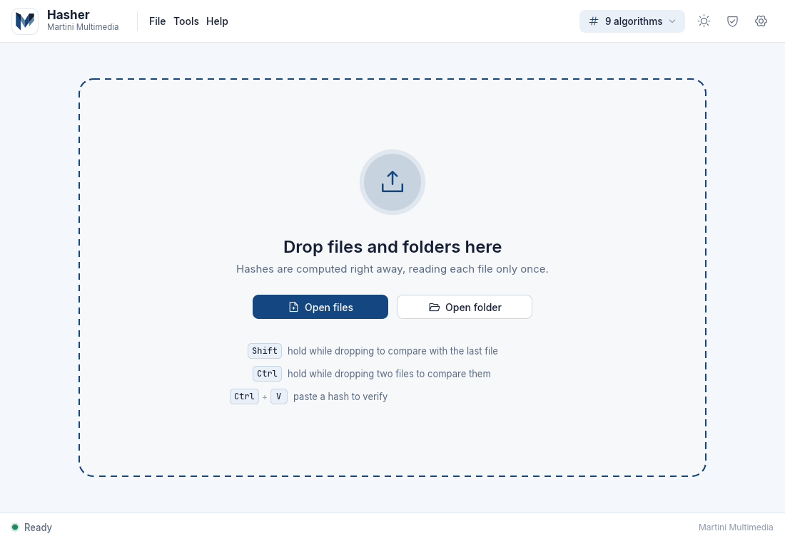
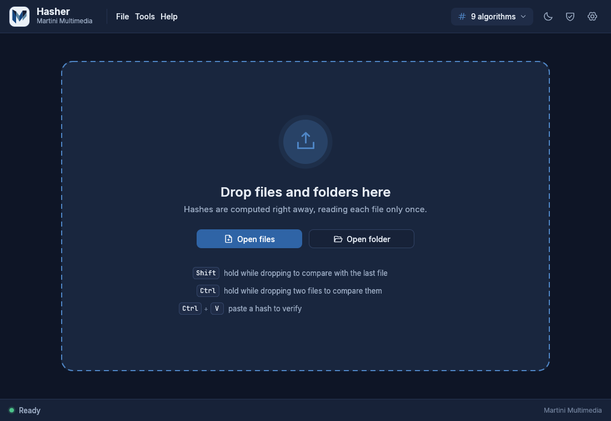
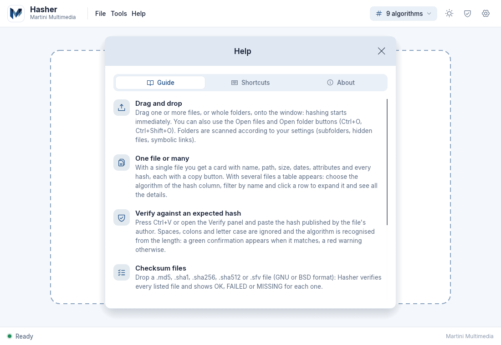
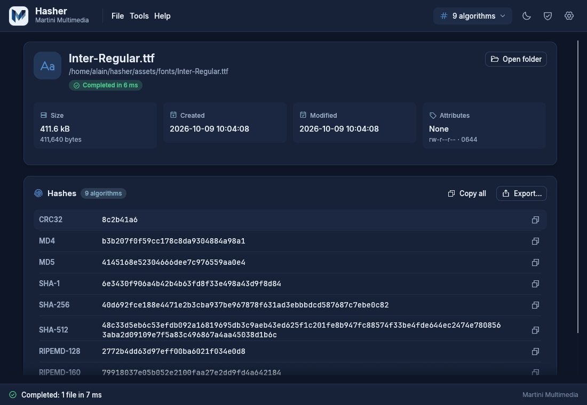
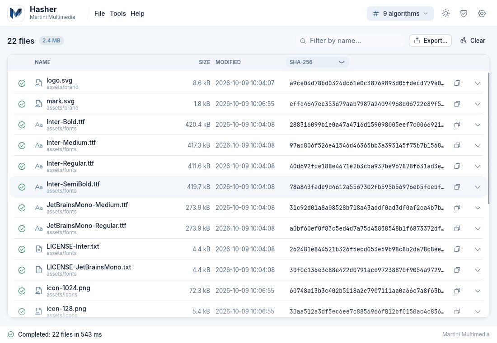

# User Guide

A tour of the Hasher window, from opening files to reading the results. Verification and export have their own pages: [[Verifying Hashes]] and [[Exporting]].

| Light | Dark |
|---|---|
|  |  |

## The window at a glance

**Top bar** (left to right)

- The Martini Multimedia mark and the **File / Tools / Help** menus.
- On the right: the **algorithm quick selector** (shows e.g. "9 algorithms"), the **theme button**, the **Verify panel toggle** (shield icon) and **Settings** (gear icon).

**Menus**

| Menu | Entries |
|---|---|
| File | Open files... (`Ctrl+O`), Open folder... (`Ctrl+Shift+O`), Open checksum file..., Export... (`Ctrl+E`), Clear list (`Ctrl+L`), Quit |
| Tools | Verify hash... (`Ctrl+V`), Compare two files, Cancel computation (`Esc`), Settings... (`Ctrl+,`) |
| Help | Guide (`F1`), Keyboard shortcuts, About |

**Status bar** (bottom). On the left: *Ready*, *N files in the list*, *Hashing: 3 of 12 files* (with a spinner), *Completed: 12 files in 4.2 s*, *Completed: 12 files, 2 errors* or *Cancelled · 5 files completed*. While hashing, the right side shows the **overall progress bar**, the percentage, the **speed** (MB/s), the **estimated time left** and a **Cancel** button. After a cancellation a **Resume** button appears. The *Martini Multimedia* credit on the far right links to the company website.

**Help window** (`F1`): three tabs - Guide, Shortcuts, About (version, licences of the components).

## Opening files

- **Drag and drop** files and folders onto the window. While you hover, a full-window overlay says *Release to compute* and tells you what the modifiers will do.
- **Open files** (`Ctrl+O`) and **Open folder** (`Ctrl+Shift+O`) from the File menu or the two buttons of the empty window. Clicking anywhere in the empty drop zone also opens the file dialog.
- **Command line**: every non-option argument is opened right away, as if dropped: `hasher photo.jpg ~/Downloads`. See [[FAQ and Troubleshooting]] for the full list of options.
- **Checksum files**: dropping a *single* file whose extension is a checksum extension (`.md5`, `.sha256`, `.sfv`, ...) does not hash it; it verifies the files it lists instead ([[Verifying Hashes]]).

Opening something new replaces the current list. The algorithms used are the ones selected in the quick selector (initially your defaults from [[Settings]]).

## Single-file view

When exactly one file is open (and no folder), Hasher shows a card:

- **Header**: file icon, name, full path, a status badge (*Queued*, *Computing*, *Completed in 1.2 s*, *Error*, *Cancelled*) and an **Open folder** button that opens the containing folder in your file manager. While computing: percentage, `done of total · speed` and a progress bar.
- **Information grid**
  - **Size**: human readable, base 10 (1 MB = 1,000,000 bytes), and the exact byte count underneath.
  - **Created** and **Modified**. A date the file system cannot provide is shown as *n/a*.
  - **Attributes**: names plus short codes, and on Linux/macOS the permissions in `ls -l` style and octal (for example `X · rwxr-xr-x · 0755`).
- **Hashes** card: one row per active algorithm with the hash in a monospace font and a **copy button** (toast: *SHA-256 hash copied*). **Copy all** puts every `NAME  hash` line on the clipboard. **Export...** opens the export dialog.

Attribute short codes:

| Code | Meaning | Code | Meaning |
|---|---|---|---|
| `R` | Read-only (Linux/macOS: no owner write bit) | `E` | Encrypted (Windows) |
| `H` | Hidden (Windows attribute; dot-name on Linux/macOS) | `T` | Temporary (Windows) |
| `S` | System (Windows) | `P` | Sparse (Windows) |
| `A` | Archive (Windows) | `O` | Offline (Windows) |
| `C` | Compressed (Windows) | `I` | Not content-indexed (Windows) |
| `L` | Symbolic link / reparse point | `X` | Executable (any exec bit; `.exe .com .bat .cmd .msi .ps1` on Windows) |
| `U` `G` `K` | Set-UID, Set-GID, sticky bit | | |

## List view

More than one file, a folder, or a checksum file switches to the table:

| Part | What it does |
|---|---|
| Toolbar | File count and total size, *N selected* badge, **Filter by name...** box, **Remove** (when rows are selected), **Resume (n)**, **Export...**, **Clear** |
| Status icon | dashed circle = queued, spinner = computing, green check = done, green seal = matches the verification, red cross = does not match, red warning = error, stop = cancelled |
| Name | File name, with the containing folder in small type below |
| Size | Human-readable size |
| Modified | Hidden automatically when the window is narrower than about 860 px |
| Hash | The hash of the algorithm chosen in the **column header drop-down**; a progress bar while computing; a copy button |
| Arrow | Expands the row to the full metadata grid and all hashes |

- **Click** a row: select it and expand/collapse its details. **Ctrl+click** (**Cmd** on macOS) toggles selection, **Shift+click** selects a range. Ctrl+clicking until exactly two rows are selected opens the comparison ([[Verifying Hashes]]).
- **Right-click**: *Copy <algorithm>*, *Copy all*, *Open folder*, *Remove from list*.
- **Del** removes the selected rows, **Ctrl+L** (or the *Clear* button) empties the list.
- The **filter** is case-insensitive and matches file names and folder names.

## Folders and recursion

A dropped folder is scanned while hashing already runs on the files found so far. Files are visited in path order and duplicates are ignored. Three settings control the scan ([[Settings]]): **recurse** into subfolders (default on), **include hidden files** (default off; hidden means a name starting with `.` or the Hidden attribute on Windows) and **follow symbolic links** (default off - links are skipped). Files you select explicitly are always hashed, even if hidden. Unreadable entries inside a folder are skipped; an unreadable file that you named explicitly is listed with an *Error* message.

## Algorithm quick selector

The button in the top bar opens a pop-up with all 22 algorithms grouped as CHECKSUM, MD, RIPEMD, SHA, BLAKE and P2P. Tick or untick algorithms to change what is **shown and computed from now on**; at least one must stay selected. MD2 carries a *slow* badge ([[Algorithms]]). **Restore defaults** returns to the selection saved in Settings, and **Recompute** hashes the current inputs again with the new selection (it is enabled when nothing is running). This selector does not change the saved defaults.

## Progress, cancel and resume

- Progress is per file (row bar) and overall (status bar). Speed is a smoothed average and the ETA is `remaining bytes / speed`, shown as *~ 12 s left*; it appears as a dash until a speed is known.
- **Cancel** (button or `Esc`) stops as soon as the 1 MiB block being processed is finished. Files already finished keep their results; the others become *Cancelled* and the **Resume** button re-hashes only those.
- Several files are hashed at once (automatic: the smaller of your CPU cores and 4; adjustable in Settings).

## Notifications (toasts)

Short messages appear at the bottom right: *SHA-256 hash copied*, *All hashes copied*, *Exported to report.csv*, *Settings saved*, errors (shown twice as long). They disappear on their own after about 2.5 seconds.

## Theme, animations and language

- The **theme button** cycles *Automatic* (follows the operating system) → *Light* → *Dark*. The choice is saved. If the system theme cannot be detected, light is used.
- Animations (pulsing drop zone, shimmer on queued rows, fading rows, animated counters) can be turned off in Settings.
- The interface language follows the system by default and can be changed in Settings (effective immediately). Italian, English, French, German and Spanish are fully translated.

## Keyboard and mouse reference

On macOS `Ctrl` is **Cmd**.

| Shortcut | Action |
|---|---|
| `Ctrl+O` | Open files |
| `Ctrl+Shift+O` | Open folder |
| `Ctrl+E` | Export the results |
| `Ctrl+V` | Paste a hash to verify (opens the Verify panel) |
| `Ctrl+L` | Clear the list |
| `Ctrl+,` | Settings |
| `F1` | Guide |
| `Esc` | Cancel the computation; otherwise close the Export, Settings or Help window |
| `Del` | Remove the selected files |
| `Ctrl+click` | Select several files (two files: comparison) |
| `Shift+click` | Select a range of files |
| `Shift` + drop | Drop **one** file while holding Shift: compare it with the last file in the list |
| `Ctrl` + drop | Drop **two** files while holding Ctrl: compare them |

`Del` and `Esc` are ignored while a text field (filter, hash box) has the focus.

Next: [[Verifying Hashes]].
