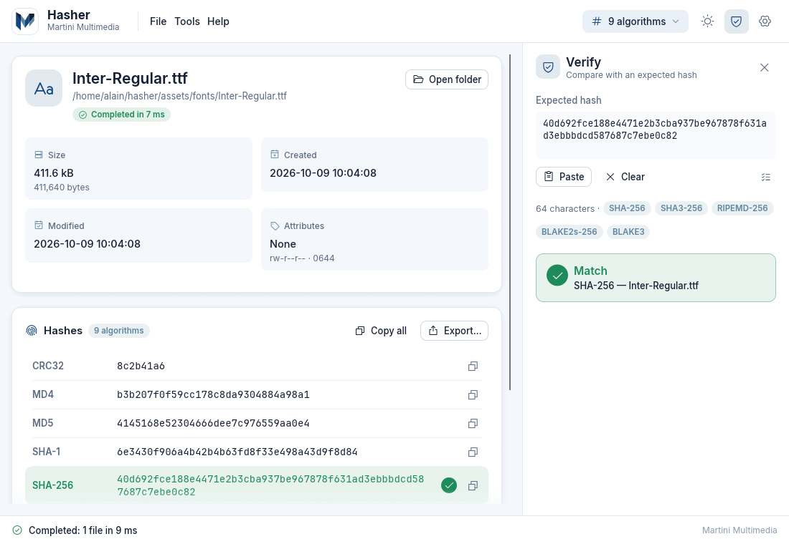

# Verifying Hashes

Hasher offers three ways to check that a file is what it should be. All of them live in the **Verify panel**, which slides in on the right. Open it with **Ctrl+V** (with text on the clipboard), **Tools → Verify hash...** or the shield icon in the top bar.



| Method | Use it when | How |
|---|---|---|
| [Paste an expected hash](#paste-an-expected-hash) | A web page, mail or README publishes a hash | Drop the file, press `Ctrl+V` |
| [Verify with a checksum file](#verify-with-a-checksum-file) | You downloaded `*.sha256`, `SHA256SUMS`, `*.sfv`... | Drop the checksum file |
| [Compare two files](#compare-two-files) | You want to know if two copies are identical | `Ctrl`+click two rows, or `Ctrl`+drop two files |

## Paste an expected hash

1. Drop the file (or files) to check; the default algorithms are computed.
2. Press **Ctrl+V** anywhere in the window (outside a text field). The panel opens and the clipboard is pasted into the *Expected hash* box. You can also click **Paste**, which replaces the box content, or type/paste directly into the box. If the box already contains text, `Ctrl+V` only focuses it - use **Paste** or **Clear**.
3. Hasher reads the text, detects the algorithm(s) from the length and compares it with the computed digests.

You can paste the hash before dropping the file: the panel says *Drop a file to check it against this hash* and checks as soon as results arrive.

### What counts as a valid hash

The text is normalised before use:

| Rule | Example |
|---|---|
| Upper/lower case is ignored | `E3B0C442...` = `e3b0c442...` |
| Spaces, tabs, line breaks, colons `:` and dashes `-` are removed | `e3:b0:c4:42...`, `e3b0c442 98fc1c14 ...` |
| A leading `0x` is removed | `0xCBF43926` |
| Only `0-9 a-f` may remain | otherwise *Not a hexadecimal hash* |
| The length must match a supported algorithm | otherwise *Invalid length: N characters* |

If the whole text is not a hash, Hasher looks for the longest hexadecimal word in it. So you can paste a **whole line** copied from a checksum file or a web page, such as `e3b0c442...b855  empty.txt` or `SHA256 (empty.txt) = e3b0c442...b855`, and the file name is ignored.

### Algorithm detection by length

| Hex characters | Bits | Candidate algorithms |
|---|---|---|
| 8 | 32 | CRC32 |
| 16 | 64 | CRC64, xxHash64 |
| 32 | 128 | MD2, MD4, MD5, RIPEMD-128, ED2K, xxHash3-128 |
| 40 | 160 | SHA-1, RIPEMD-160 |
| 56 | 224 | SHA-224 |
| 64 | 256 | SHA-256, SHA3-256, RIPEMD-256, BLAKE2s-256, BLAKE3 |
| 80 | 320 | RIPEMD-320 |
| 96 | 384 | SHA-384 |
| 128 | 512 | SHA-512, SHA3-512, BLAKE2b-512 |

The candidates are shown as badges under the box. When several algorithms share a length (32 characters are the classic case), every candidate that was computed is tried, and the result tells you which one matched, e.g. *RIPEMD-160 - file.bin*.

### Reading the result

- **Green *Match*** - lists up to six `algorithm - file` pairs (*and N more*). In the list view the matching row turns green with a seal icon and, in the hash rows, the matching algorithm is green. When nothing matches, the rows of all the candidate algorithms turn red.
- **Red *No match*** - *None of the N computed files has this hash.*
- *Waiting for results...* - the computation is still running.

> **Important:** the pasted hash is compared only with algorithms that were **computed**. If you paste a BLAKE3 hash while BLAKE3 is not selected, you get *No match* even for the right file. Tick the algorithm in the top-bar quick selector and press **Recompute**.

## Verify with a checksum file

Drop a **single** file with a checksum extension, or use **File → Open checksum file...** (also available as the list icon in the Verify panel). Hasher reads it, hashes the files it lists and reports one verdict per line. Algorithms that the checksum file needs are computed automatically, even if they are not in your active selection.

> A single dropped file with one of these extensions is *always* treated as a checksum file. To compute the hash of a `.md5`/`.sha256` file itself, drop it together with another file or inside a folder.

### Supported formats

```text
# GNU coreutils (md5sum, sha256sum, b2sum...): two spaces, or space + * for binary mode
d41d8cd98f00b204e9800998ecf8427e  empty.txt
d41d8cd98f00b204e9800998ecf8427e *binary.bin

# BSD / "coreutils --tag" style, the algorithm is written in the line
SHA256 (empty.txt) = e3b0c44298fc1c149afbf4c8996fb92427ae41e4649b934ca495991b7852b855
SHA3-256 (data.bin) = a7ffc6f8bf1ed76651c14756a061d662f580ff4de43b49fa82d80a4b80f8434a

# OpenSSL style
MD5(empty.txt)= d41d8cd98f00b204e9800998ecf8427e

# SFV (CRC32, file name first)
; comment lines start with ; or #
empty.txt 00000000
```

- Lines that are empty or start with `;` or `#` are ignored; unrecognised lines are skipped silently.
- UTF-8 (with or without BOM) and UTF-16 (LE/BE, with BOM) files are read; CRLF and LF line endings both work.
- File names written by coreutils with escapes (a line starting with `\`, then `\\`, `\n`, `\r`) are decoded.
- BSD labels are matched loosely (`SHA256`, `sha-256`, `SHA3-256`, `BLAKE2b`, `RMD160`, `XXH128`...). A line whose algorithm is unknown is skipped, as is a hash whose length does not match the label.
- Without a label the algorithm comes from the **extension** (`.sha256` → SHA-256) or from names like `SHA256SUMS`; if the hash length does not fit that algorithm, or there is no hint (`.hash`, `.sum`, `.checksum`), the **length** decides, using the candidate table above.
- File names are resolved **relative to the folder of the checksum file**; absolute paths work too.

**Extensions recognised for drag and drop:** `sfv`, `md5`, `md5sum`, `sha`, `sha1`, `sha1sum`, `sha224`, `sha256`, `sha256sum`, `sha384`, `sha512`, `sha512sum`, `sha3`, `b2`, `b2sum`, `blake2`, `blake3`, `b3`, `ed2k`, `crc32`, `hash`, `checksum`, `sum`. A plain `.txt` (such as `SHA256SUMS.txt`) is not recognised automatically; rename it, e.g. to `SHA256SUMS.sha256`, or paste a line from it as described above.

### How results are shown

The panel lists every line of the file with a status chip and badges with the counters:

| Status | Meaning |
|---|---|
| **OK** | The computed hash equals the one in the file |
| **FAILED** | The file exists but the hash differs |
| **MISSING** | The listed file was not found next to the checksum file (or the path is not a regular file) |
| **ERROR** | The file exists but could not be read (hover for the message) |
| **PENDING** | Still being hashed |

A summary card says **All files are intact** (*N files verified successfully*) or **Verification failed** (*Failed: x · missing: y*). The same verdicts colour the rows of the list view. **Close verification** dismisses the result.

## Compare two files

- In the list, **Ctrl+click** (Cmd on macOS) two rows; or
- drop **two files while holding Ctrl**; or
- drop **one file while holding Shift** to compare it with the last file in the list. The previous file and the new one are re-hashed together and selected automatically.

The panel shows files **A** and **B**, then one line per active algorithm: **Identical** or **Different**, and a summary card (*The files are identical - All N hashes match* / *The files are different*). *Tools → Compare two files* opens the panel if exactly two rows are selected, otherwise it reminds you how to select them.

## Tips: which algorithms prove what

| Kind | Algorithms | Use for |
|---|---|---|
| Cryptographic, recommended | SHA-224/256/384/512, SHA3-256/512, BLAKE2b/2s, BLAKE3 | Checking that a download was not tampered with |
| Cryptographic but weak or legacy | MD5, SHA-1, MD4, MD2, RIPEMD-128 | Detecting accidental corruption only; collisions can be forged |
| Sound but little used | RIPEMD-160 (RIPEMD-256/320 only widen the output of RIPEMD-128/160, with the same security level) | Interoperability with systems that publish them |
| Non-cryptographic checksums | CRC32, CRC64, xxHash64, xxHash3-128 | Detecting transmission errors; never for security |
| Network identifier | ED2K | Matching eMule/eDonkey file hashes |

Compare against a hash obtained through a **different, trusted channel** (an HTTPS page of the author, a signed announcement). A hash published next to the download only protects against corruption, not against a compromised server. More on each algorithm in [[Algorithms]].
